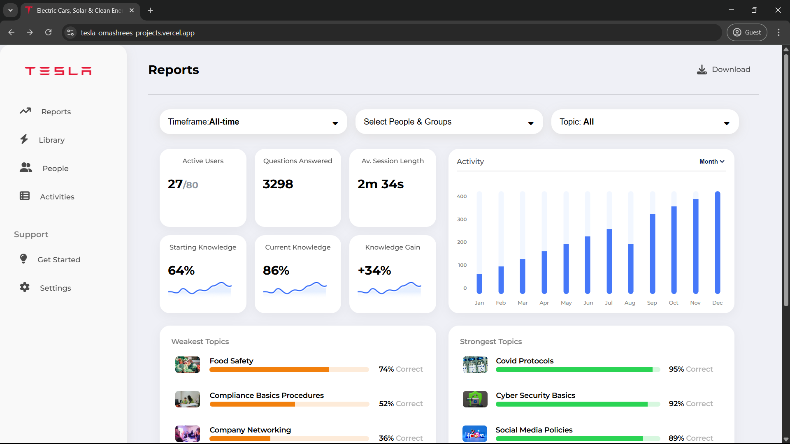
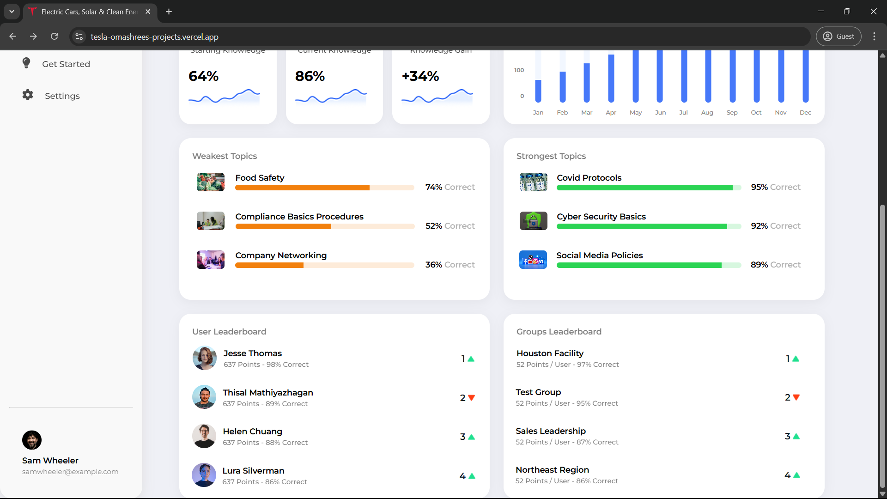

# 📊 Full-Stack Dashboard with Image Download Feature

A responsive, full-stack dashboard application built with **Node.js**, **Express.js**, **EJS**, and **JavaScript**. It dynamically fetches data from a JSON file and allows users to download an image via external API integration.

🔗 **Live Demo**: [tesla-omashrees-projects.vercel.app](https://tesla-omashrees-projects.vercel.app)

---

## ✨ Features

* **Mobile-Responsive Layout**: Optimized for both desktop and mobile devices.
* **Dynamic Data Display**: Fetches and renders dashboard data from a local `task-data.json` file.
* **Image Download via API**: Sends a `POST` request containing an `api_secret`, retrieves a Base64 image string, and enables user download.
* **EJS Templating**: Renders dashboard content dynamically with EJS.

---

## 📁 Project Structure

```
/project-root
├── /public/             # Static files (CSS, JS)
│   ├── style.css
│   └── script.js
├── /views/              # EJS templates
│   └── index.ejs
├── task-data.json       # Data file containing api_secret and other details
├── index.js             # Main server file (Express.js)
└── README.md            # Project documentation
```

---

## 🏁 Getting Started

### Prerequisites

* [Node.js](https://nodejs.org/en/download/package-manager/current)
* [Git](https://git-scm.com/downloads)

### Installation

```bash
git clone https://github.com/your-username/your-repo-name.git
cd your-repo-name
npm install
npm start
```

Visit `http://localhost:8080` in your browser.

---

## ⚙️ How It Works

1. **Data Loading**

   * `task-data.json` contains structured data including `api_secret`.
   * This file is read by the server and passed to the dashboard on page load.

2. **Rendering the Dashboard**

   * The data is displayed using `EJS` templates.

3. **Download Feature**

   * When the "Download" button is clicked, a `POST` request is sent to:
     `https://testd5-img.azurewebsites.net/api/imgdownload`
   * Request body:

     ```json
     { "api": "<api_secret>" }
     ```
   * The API returns a Base64-encoded image string, which is converted into a downloadable image file in the browser.

---

## 📌 Notes

* Ensure `task-data.json` exists and contains a valid `api_secret` key.
* The API endpoint must be accessible for the download feature to work correctly.

---

## 📸 Screenshots





---

## 📄 License

This project is licensed under the **MIT License**. See the `LICENSE` file for more details.
